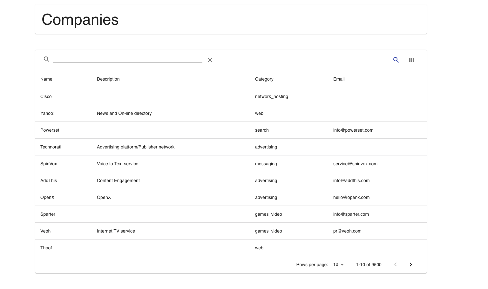
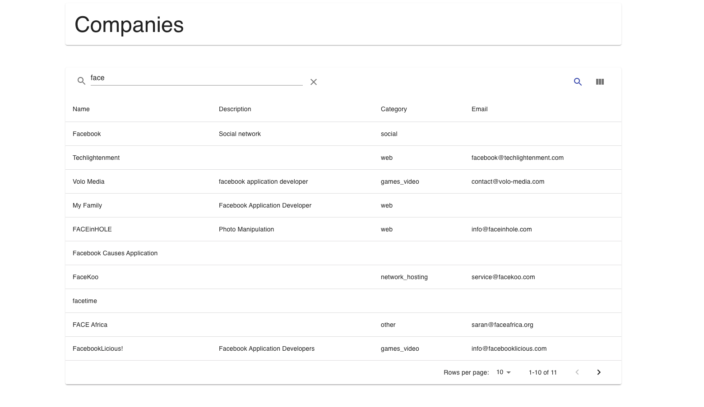

# Rethink assignment - Large Search

- MongoDB is used as the backend database.
- Server side pagination and search on a large dataset of Companies. Tested with 9500 records. Sample company records from hosted mongodb is used here.
- React is used for the frontend interface and nodejs with express for the backend.
- `mongoose` is used for interaction with MongoDB.

All records


Record searching


# Backend

## Steps to run: Backend

**Note:** Run backend first

**Configs:** Database connection settings needs to be upated in `backend/.env` file with the following keys

Sample values shown below.
```
DB_HOST=cluster0-shard1.mongodb.net:27017,cluster0-shard2.mongodb.net:27017,cluster0-shard3.mongodb.net:27017
DB_USER=abc
DB_PASS=abc
DB_COLLECTION=sample_training
```

1. `cd backend`
2. `npm install`
3. `npm start`
4. Default port for backend is `5000`, which can be overridden in `backend/.env` file.

---
# Frontend

## React

1. [mui-datatables](https://github.com/gregnb/mui-datatables) is used for data grid. Search and pagination is handled server-side.
2. Option to show/hide columns on the datagrid.
3. Search performed across the 4 columns displayed on the grid.

## Steps to run

**Configs:** Server `host` and `port` settings are present in the `.env` file in the root folder.

Update the `.env` as per the settings of the backend server.

Sample values shown below.

```

REACT_APP_SERVER_HOST=http://localhost
REACT_APP_SERVER_PORT=5000

```

1. In the root folder - `npm install`
2. `npm start`

---

# General comments and assumptions

1. On each key-stroke, API request is sent to the server with  `searchText` and `page` number to load the respective page.
2. Search is done across all 4 columns shown on the grid using `regex` operator of mongodb.
3. Only read/search operation is supported in this interface.